# Tarea 4

## José Tomás Acuña  
**Número de alumno:** 20626630  

---

### Caso 1: Servidor UDP

#### 1. Filtro para capturar paquetes UDP con IP de destino 255.255.255.255  

El filtro necesario para capturar paquetes cuya IP de destino sea `255.255.255.255` y que además, el protocolo sea UDP es:

```
udp && ip.dst == 255.255.255.255
```


> Este filtro captura exclusivamente paquetes enviados mediante el protocolo UDP a la dirección de broadcast (`255.255.255.255`).


#### 2. Imagen de los paquetes UDP en Wireshark
 
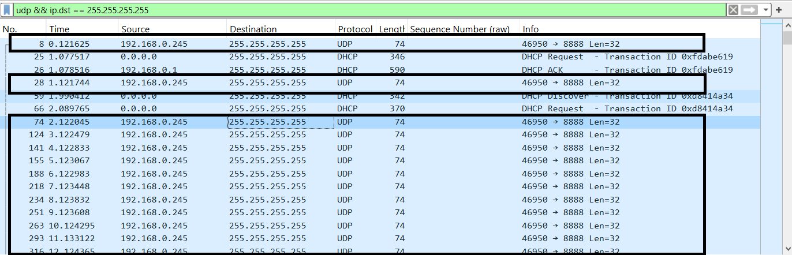  


---

#### 3. Tamaño completo del paquete  

El tamaño completo del paquete es de **74 bytes**. Los bytes se distribuyen de la siguiente manera:  

- **Internet Protocol (Capa de red):** 60 bytes  
  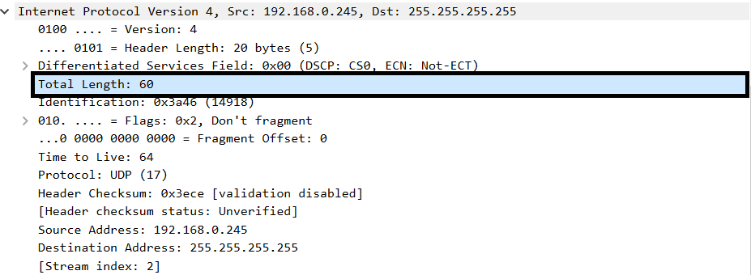  

- **UDP (Capa de transporte):** 40 bytes  
  - 8 bytes corresponden al encabezado.  
  - 32 bytes corresponden al payload.  
  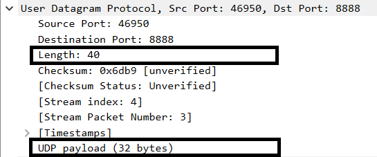  

- **Encabezado de Ethernet II (Capa de Enlace de Datos):** 14 bytes  

En resumen, los **74 bytes** del paquete se distribuyen en:

- **60 bytes** IP + **14 bytes** Ethernet  

Dentro de los **60 bytes de IP** se encuentran los **40 bytes de la capa UDP**:  
- **8 bytes** de encabezado.  
- **32 bytes** de payload.  

---

#### 4. Mensaje del servidor  

El mensaje que emite el servidor es:  

```
Mi numero de la suerte es: 375
```

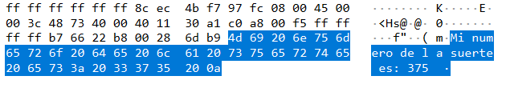  

El tamaño del mensaje es **32 bytes**. 
  

#### 5. Subred en 192.168.0.0/24  

La subred `192.168.0.0/24` tiene **\( 2^8 \)** direcciones en total, donde:  
- La **primera dirección** (`192.168.0.0`) es la dirección de red.  
- La **última dirección** (`192.168.0.255`) es la dirección de broadcast.  

Esta última dirección (`192.168.0.255`) permite enviar mensajes a todos los dispositivos de la red.  

Fuente: [IONOS - Broadcast IP](https://www.ionos.com/es-us/digitalguide/servidores/know-how/broadcast-ip/#:~:text=La%20broadcast%20IP%20permite%20enviar,realizar%20la%20transmisi%C3%B3n%20de%20datos.)

---

### Caso 2: Servidor HTTP

#### 1. User-Agent utilizado  

El **User-Agent** con el cual se realizan las solicitudes es: 

```
User-Agent: Mozilla/5.0 (Windows NT 10.0; Win64; x64) AppleWebKit/537.36 (KHTML, like Gecko) Chrome/130.0.0.0 Safari/537.36
```
Esta información se puede encontrar en la sección de **Hyper Transfer Protocol**

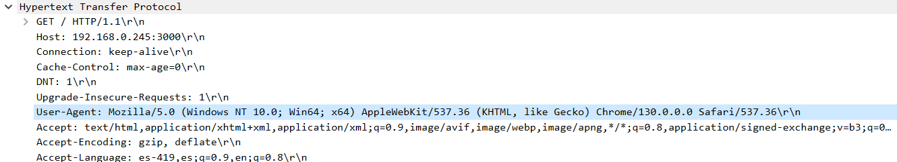

#### 2. Códigos de respuesta HTTP  

##### Acceso a `/onions.txt`  

El código de respuesta es **200 OK**.  

De acuerdo a MDN Web Docs:  
> "El código de respuesta satisfactorio HTTP 200 OK indica que la solicitud ha tenido éxito."

  
  

##### Acceso a `/missing.txt`  

El código de respuesta es **404 Not Found**.  

> "El código de error HTTP 404 Not Found, de respuesta del cliente, indica que el servidor no puede encontrar el recurso solicitado. Los vínculos que conducen a una página 404 son normalmente llamados _vínculos rotos_ o _vínculos muertos_, y pueden estar sujetos a un enlace roto."

  
  


#### 3. Dirección obtenida de la imagen de Fiu  

Usando la herramienta **Inspeccionar elementos**, se encontró la dirección del recurso:  

```
http://192.168.0.245:3000/84729098/c85hmnowu48n/x8472nm983/fiu.png
```

No se encontró el paquete **GET** en el análisis de paquetes.  
Tras investigar, es probable que la imagen estuviera en la **caché del navegador**, lo que significa que el navegador no realizó nuevamente la solicitud al servidor.

Adjunto una imagen de mi historial donde aparece la dirección solicitada durante la actividad:  

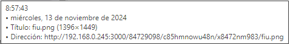

#### 4. GET Requests  

En total, mi computador (cliente) realizó **16 GETs** al servidor.  

En la siguiente imagen se pueden observar todos los GETs realizados durante la actividad:  

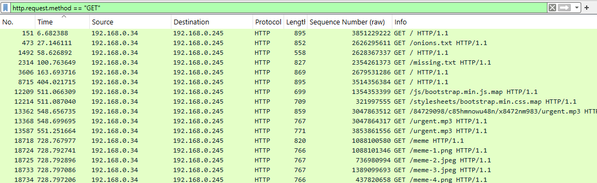  


#### Detalle de las Solicitudes GET

1. **GET / HTTP/1.1**
   - **Respuesta**: 200 OK (text/html)
   - **Descripción**: Se trata de una solicitud a la página principal (`/`). 

2. **GET /onions.txt HTTP/1.1**
   - **Respuesta**: 200 OK (text/plain)
   - **Descripción**: Solicitud para un archivo de texto llamado `onions.txt`. 

3. **GET /missing.txt HTTP/1.1**
   - **Respuesta**: 404 Not Found
   - **Descripción**: Solicitud para un archivo llamado `missing.txt`, el cual no se encontró en el servidor.

4. **GET / HTTP/1.1**
   - **Respuesta**: 404 Not Found
   - **Descripción**: Otro intento de acceder a la página principal (`/`). Esta vez, la respuesta fue un error 404, lo que podría indicar algún problema intermitente en el servidor o un recurso ausente temporalmente.

5. **GET / HTTP/1.1**
   - **Respuesta**: 500 Internal Server Error
   - **Descripción**: Otra solicitud a la página principal que devolvió un error 500, indicando un fallo en el servidor mientras intentaba procesar la solicitud.

6. **GET /js/bootstrap.min.js.map HTTP/1.1**
   - **Respuesta**: 200 OK (text/html)
   - **Descripción**: Solicitud de un archivo de JavaScript (`bootstrap.min.js.map`).

7. **GET /stylesheets/bootstrap.min.css.map HTTP/1.1**
   - **Respuesta**: 200 OK (text/html)
   - **Descripción**: Solicitud de un archivo de CSS (`bootstrap.min.css.map`). 

8. **GET /847292098/c8shnmowu48n/x8472n983/urgent.mp3 HTTP/1.1**
   - **Respuesta**: 200 OK (audio/mpeg)
   - **Descripción**: Solicitud para un archivo de audio `urgent.mp3`. 

9. **GET /urgent.mp3 HTTP/1.1**
   - **Respuesta**: 200 OK (audio/mpeg)
   - **Descripción**: Otro intento para acceder al archivo `urgent.mp3`.

10. **GET /meme-1.png HTTP/1.1**
    - **Respuesta**: 200 OK (JPEG JFIF image)
    - **Descripción**: Solicitud para la primera imagen `meme-1.png`. 

11. **GET /meme-2.jpeg HTTP/1.1**
    - **Respuesta**: 200 OK (JPEG JFIF image)
    - **Descripción**: Solicitud para la segunda imagen `meme-2.jpeg`. 

12. **GET /meme-3.jpeg HTTP/1.1**
    - **Respuesta**: 200 OK (JPEG JFIF image)
    - **Descripción**: Solicitud para la tercera imagen `meme-3.jpeg`.

13. **GET /meme-4.png HTTP/1.1**
    - **Respuesta**: 200 OK (JPEG JFIF image)
    - **Descripción**: Solicitud para la cuarta imagen `meme-4.png`. 

14. **GET /favicon.ico HTTP/1.1**
    - **Respuesta**: 200 OK (PNG)
    - **Descripción**: Solicitud para el ícono de la página (`favicon.ico`). 

15. **GET /logo.png HTTP/1.1**
    - **Respuesta**: 200 OK (PNG)
    - **Descripción**: Solicitud para el logotipo de la página (`logo.png`). 

16. **GET /background.jpg HTTP/1.1**
    - **Respuesta**: 200 OK (JPEG image)
    - **Descripción**: Solicitud para la imagen `background.jpg`. 

#### 5. Tabla con Bytes de los Accesos

| URI                                          | Total Bytes Retornados |
|----------------------------------------------|-------------------------|
|**Total** | **12487 bytes**
| / (primera vez) | 895 | 
| / | 558 |
| / | 869 |
| / (segunda vez) | 895 |
| /urgent.mp3 | 1630 |
| /847229098/c85hmnowu48n/x8472nm983/urgent.mp3 | 1382 |
| /onions.txt | 852 |
| /missing.txt | 827 |
| /meme-2.jpeg | 767 |
| /meme-3.jpeg | 767 |
| /meme-1.png | 766 |
| /meme-4.png | 766 |
| /stylesheets/bootstrap.min.css.map | 709 |
| /js/bootstrap.min.js.map | 699 |

##### Imagen con los paquetes HTTP

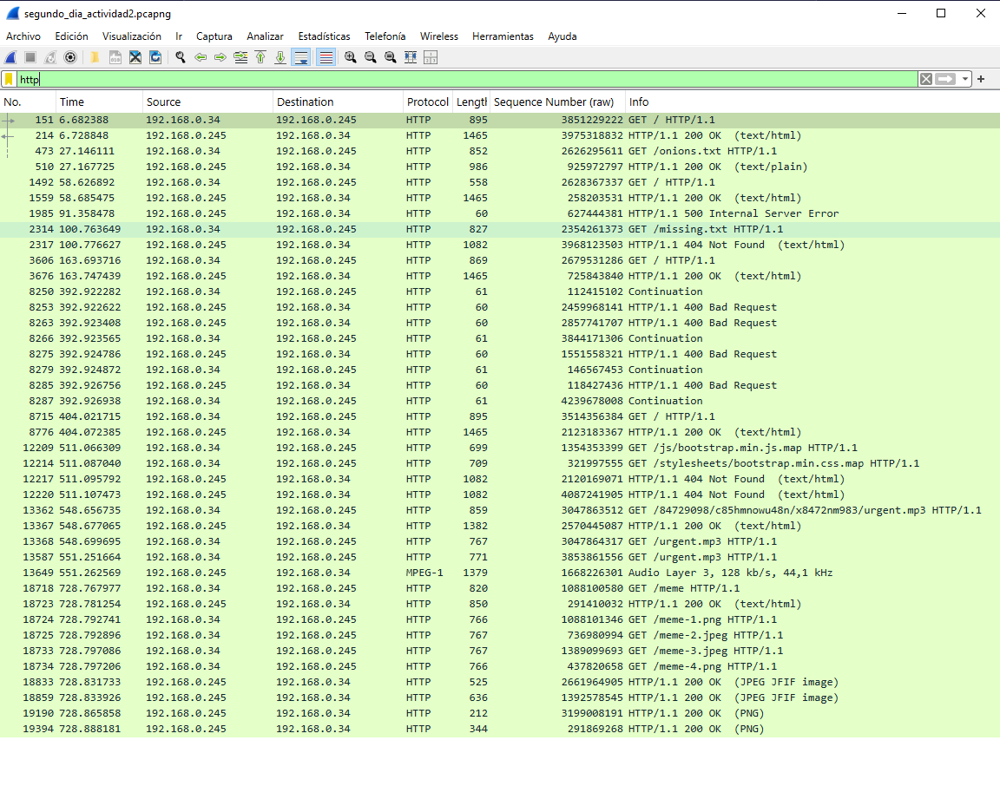

---

### Caso 3: Protocolo de mensajes

#### 1. Protocolo ICMP  

De acuerdo a Wikipedia:

> "Ping operates by means of Internet Control Message Protocol (ICMP) packets. Pinging involves sending an ICMP echo request to the target host and waiting for an ICMP echo reply."  
[Fuente: Wikipedia - Ping](https://en.wikipedia.org/wiki/Ping_(networking_utility))

Este protocolo (**ICMP**) se utiliza para enviar mensajes de error y control en las redes IP. La diferencia con otros protocolos de transporte como **TCP** o **UDP** es que **ICMP** no se utiliza para intercambiar información entre sistemas, sino que se emplea para diagnosticar problemas de conectividad.

[Fuente: Wikipedia - ICMP](https://en.wikipedia.org/wiki/Internet_Control_Message_Protocol)

##### Paquetes ICMP recibidos: 

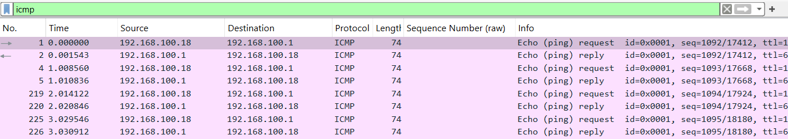  


---

#### 2. Protocolo ARP  

El protocolo **ARP** (Address Resolution Protocol) es un protocolo de la capa de enlace de datos, responsable de encontrar la dirección de hardware (**Ethernet MAC**) que corresponde a una determinada IP.

[Fuente: Wikipedia - Protocolo de resolución de direcciones](https://es.wikipedia.org/wiki/Protocolo_de_resoluci%C3%B3n_de_direcciones)

##### Imagen de los paquetes del protocolo ARP recibidos

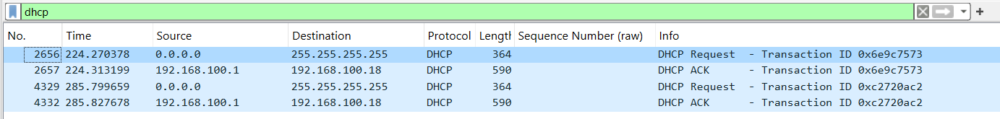

---

#### 3. Protocolo DHCP  

El protocolo **DHCP** se utiliza para asignar direcciones IP a los dispositivos que se conectan a una red.

**Acciones realizadas**:  
1. Revisar la configuración de la red 

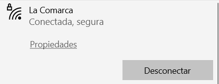
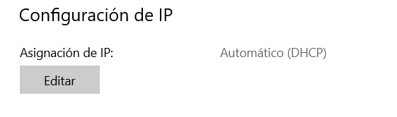

La asignación de IP está configurada en DCHP.

2. Aplicar filtro **dhcp** en Wireshark

3. Volver a realizar la conexión a la red local


Se puede observar la captura de dos paquetes **DHCP** en Wireshark, lo que indica que el servicio de **DHCP** está activado en mi red local.


